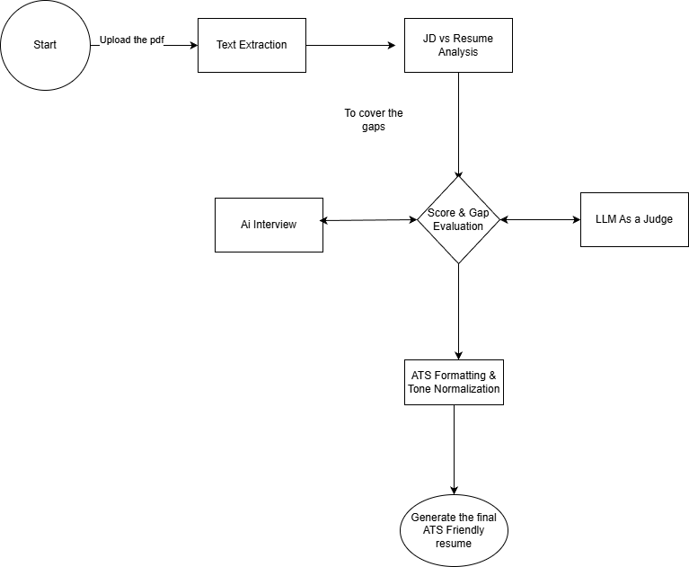

# AI Feedback Resume Builder (JD-Fit Resume Intelligence)

An end-to-end **Job Description → Resume Analysis → AI Interview → JD-fit Resume Generator**
built with Streamlit + LLMs.

This repository represents a **completed portfolio phase** of applied GenAI system design.

## What it does
1. Upload Job Description (PDF) + Resume (PDF)
2. Analyze JD vs Resume (skills, gaps, competencies)
3. Optional AI-led interview to capture missing impact
4. Generate ATS-optimized JD-fit resume
5. Export to PDF / DOCX

## Key Highlights
- Hybrid JD–Resume analysis (text + structured JSON)
- Competency-driven interview flow
- LLM-as-judge refinement loop
- ATS-safe formatting & exports
- Token usage and cost tracking

## Tech Stack
Python · Streamlit · OpenAI · spaCy · NLTK · ReportLab · python-docx

## Quickstart
```bash
git clone https://github.com/anuraaggampa/ai_feedback_resume_builder.git
cd ai_feedback_resume_builder
python -m venv .venv
source .venv/bin/activate  # or Windows equivalent
pip install -r requirements.txt
python -m spacy download en_core_web_sm
streamlit run app.py
```
## System Architecture



## Safety & Honesty
- No hallucinated skills or metrics
- Resume content is grounded in inputs + interview answers

## License
MIT License

## Author
Sai Anuraag Gampa
